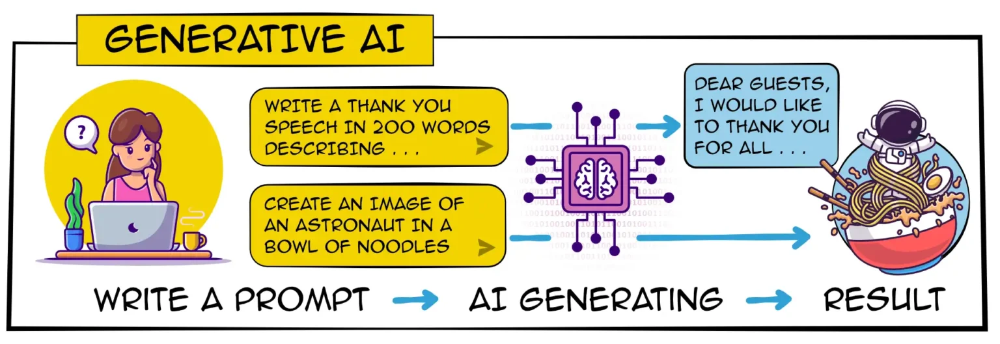

---

title: 'Generative AI: Current Trends and Practical Applications'  
subtitle: ''  
summary: A comprehensive exploration of generative AI, including key trends, applications, challenges, and future directions.  
authors:  
- admin  
tags:  
- generative-ai  
- deep-learning  
- computer-vision  
- NLP  
- AI-applications  
image:
  caption: 'Image credit: [**X.com**](https://x.com/cwolferesearch/status/1735028629904458151)'
categories:  
- generative-ai
- computer-vision
- deep-learning
- GANs
- diffusion-models
date: "2024-08-01T00:00:00Z"  
lastmod: "2024-08-01T00:00:00Z"  
featured: true  
draft: false
math: true

# Featured image
image:  
  caption: "Image source: https://marketoonist.com/2023/01/ai-tidal-wave.html"  
  placement: 2  
  focal_point: "Smart"  
  preview_only: false

# Projects (optional).
projects: []

---


{}
You can view the presentation slides for the talk 🪴 [here](https://kaopanboonyuen.github.io/files/slides/20240802_Panboonyuen_GenerativeAI.pdf).
{}



## Introduction

<p align="justify">
Generative AI refers to a category of artificial intelligence models designed to generate new content, such as text, images, music, or videos. These models have gained significant attention due to their ability to create high-quality and realistic outputs. The field has evolved rapidly, with breakthroughs in model architectures, training techniques, and applications across various domains. In this blog, we delve into the current trends, practical applications, challenges, and future prospects of generative AI.
</p>

<div style="text-align: center;">
  
  <p style="font-style: italic; margin-top: 0px;">Fig. 1. Sample of generative AI task (Image source: telecats.com, <a href="https://www.telecats.com/blog-en/ai-for-rookies/" target="_blank">blog-en/ai-for-rookies</a>)</p>
</div>

On May 26, 1995, Bill Gates wrote the influential “Internet Tidal Wave” memo at Microsoft, which marked a major shift for the company towards the emerging World Wide Web. This moment was reminiscent of a recent analogy from HubSpot CTO Dharmesh Shah, who compared Netscape's impact on the Internet to ChatGPT's influence on AI. Just as Netscape made the Internet accessible, ChatGPT is reshaping our understanding of AI, though its full effects on work and creativity remain uncertain.

Microsoft, now a major supporter of OpenAI (the creator of ChatGPT), is again at the forefront of this change, potentially challenging Google Search with ChatGPT integration into Bing. Former U.S. Treasury Secretary Larry Summers likened AI to a "caddie" that enhances our creativity and accuracy, though he cautioned against over-reliance on AI, which could lead to uniform and uninspired results. Summers also highlighted AI's potential as a transformative technology, comparable to the printing press or electricity.

## Key Trends in Generative AI

### Advances in Model Architectures

<p align="justify">
One of the most notable trends in generative AI is the development of advanced model architectures, such as Generative Adversarial Networks (GANs) (Goodfellow et al., 2014), Variational Autoencoders (VAEs) (Kingma & Welling, 2013), and Transformer-based models (Vaswani et al., 2017). These architectures have enabled the generation of high-quality content by learning complex data distributions.
</p>

### Growth in Computing Power and Data Availability

<p align="justify">
The exponential growth in computing power and the availability of large datasets have been crucial in advancing generative AI. The use of GPUs and TPUs has accelerated the training of large models, while datasets like ImageNet (Deng et al., 2009) and Common Crawl have provided diverse and extensive training data.
</p>

### Emerging Techniques and Approaches

<p align="justify">
Recent innovations, such as few-shot and zero-shot learning, have expanded the capabilities of generative models. Techniques like fine-tuning and transfer learning allow models to adapt to new tasks with limited data, demonstrating versatility and efficiency in various applications (Radford et al., 2021).
</p>

## Applications of Generative AI

### Content Creation

<p align="justify">
Generative AI has revolutionized content creation, enabling the automatic generation of text, images, music, and videos. For instance, GPT-3 (Brown et al., 2020) has demonstrated remarkable capabilities in generating human-like text, while models like DALL-E (Ramesh et al., 2021) can create novel images from textual descriptions.
</p>

### Healthcare

<p align="justify">
In healthcare, generative AI has shown promise in drug discovery and medical imaging. For example, GANs have been used to generate realistic medical images for training purposes, improving diagnostic accuracy (Frid-Adar et al., 2018). Additionally, AI models can assist in designing new molecules with desired properties, expediting the drug development process.
</p>

### Gaming and Entertainment

<p align="justify">
The gaming and entertainment industries have embraced generative AI to create immersive experiences. AI-generated characters, dialogues, and game levels enhance player engagement. Moreover, deepfake technology, powered by generative models, has opened new avenues in film and media production, allowing for realistic character portrayals and visual effects.
</p>

### Finance

<p align="justify">
In finance, generative AI is utilized for algorithmic trading, risk management, and fraud detection. AI models can generate synthetic financial data to simulate market scenarios, aiding in the development of robust trading strategies (Wiese et al., 2019). Additionally, generative models can identify unusual patterns in transactions, enhancing fraud detection systems.
</p>

<p align="justify">
For a deeper understanding of how LLMs are transforming finance, you can watch this insightful video:



### Autonomous Systems

<p align="justify">
Generative AI plays a crucial role in autonomous systems, including robotics and self-driving cars. AI-generated simulations help in training and testing autonomous agents, reducing the reliance on real-world testing. For instance, generative models can simulate complex driving scenarios, improving the safety and reliability of self-driving technology (Dosovitskiy et al., 2017).
</p>

## Challenges and Ethical Considerations

### Bias and Fairness

<p align="justify">
One of the significant challenges in generative AI is addressing bias and ensuring fairness. AI models may perpetuate societal biases present in the training data, leading to unfair or discriminatory outcomes. Researchers are actively exploring methods to detect and mitigate biases in generative models (Bender et al., 2021).
</p>

### Security and Privacy

<p align="justify">
The rise of generative AI has raised concerns about security and privacy. Deepfake technology, for example, can be misused to create realistic but fake videos, leading to misinformation and privacy violations. Ensuring the responsible use of generative AI and developing techniques to detect synthetic content are crucial to addressing these issues (Chesney & Citron, 2019).
</p>

### Environmental Impact

<p align="justify">
The training of large generative models requires substantial computational resources, contributing to the environmental impact. Researchers are exploring ways to reduce the carbon footprint of AI, such as developing energy-efficient algorithms and hardware (Strubell et al., 2019).
</p>

## Future Directions and Opportunities

<p align="justify">
The future of generative AI holds immense potential, with opportunities for interdisciplinary applications and collaborations between academia and industry. As the technology continues to evolve, it is crucial to consider its societal implications and strive for responsible and ethical deployment. The integration of generative AI in various fields, from art to science, will likely lead to groundbreaking innovations and transformative experiences.
</p>

<p align="justify">
Here is a simple Python code snippet demonstrating the basic structure of a Generative Adversarial Network (GAN) using PyTorch:
</p>

## Diffusion Model Implementation with Gaussian Diffusion

This code demonstrates the implementation of a diffusion model using a U-Net-like architecture combined with a Gaussian diffusion process. The model consists of two primary classes:

{}
1. **DiffusionModel Class**:
   - **Purpose**: Constructs an autoencoder architecture for processing and reconstructing images. The encoder extracts features from input images, while the decoder reconstructs the images from these features.
   - **Structure**:
     - **Encoder**: A series of convolutional layers that reduce spatial dimensions and increase feature channels.
     - **Decoder**: A series of transposed convolutional layers that upsample feature maps to the original image size. Uses Tanh activation in the final layer to ensure pixel values are in the range of [-1, 1].

2. **GaussianDiffusion Class**:
   - **Purpose**: Implements the Gaussian diffusion process, which includes both the forward (adding noise) and reverse (removing noise) diffusion steps.
   - **Components**:
     - **Beta Schedule**: Linearly increases noise levels over timesteps.
     - **Forward Diffusion Sample**: Adds noise to the input image according to the current timestep.
     - **Reverse Diffusion Step**: Uses the trained model to predict and remove noise from the image.
     - **Forward Method**: Executes the reverse diffusion process over all timesteps to reconstruct the image from noisy data.
{}

## Diffusion Sample Usage

The example demonstrates how to:
- Initialize the `DiffusionModel` and `GaussianDiffusion` classes.
- Create a dummy image tensor.
- Perform forward diffusion to add noise and reverse diffusion to reconstruct the image.

> The code also includes a print statement to verify the shape of the reconstructed image, ensuring it matches the expected dimensions.

{}
This setup provides a foundational framework for experimenting with diffusion models and can be adapted for various image processing and generation tasks.
{}

<!-- Python -->

```python
import torch
import torch.nn as nn
import torch.nn.functional as F
import numpy as np

# ## Diffusion Models
#
# Diffusion models are a cutting-edge approach in generative AI, particularly effective for image generation and editing tasks. They work by iteratively denoising data to recover the original distribution. The key concept is to reverse a diffusion process where noise is added and then removed to reconstruct the original data.
#
# The core objective function for diffusion models can be expressed as follows:
#
# C(x) = -1 / (σ √(2π)) * ((x - μ) / σ)² * exp(-0.5 * ((x - μ) / σ)²)
#
# Where:
# - x is the data point.
# - μ is the mean of the data distribution.
# - σ is the standard deviation of the data distribution.
#
# Another formulation for the objective function is:
#
# L(x) = 0.5 * ((x - μ) / σ)² + 0.5 * log(2πσ²)
#
# Here:
# - 0.5 * ((x - μ) / σ)² represents the squared deviation from the mean, which measures the distance between generated and target distributions.
# - 0.5 * log(2πσ²) represents the entropy term that accounts for the normalization factor in the Gaussian distribution.
#
# In a more general form, related to a stochastic process:
#
# L(x) = E[0.5 * ||x - μ||² + 0.5 * log(2πσ²)]
#
# Where E denotes the expectation over the diffusion process, capturing the average cost of deviation.
#
# This objective function measures how well the model can reverse the diffusion process, minimizing the discrepancy between the true noise and the predicted noise.
#
# Modern diffusion models, such as those used in DALL-E 2 and Stable Diffusion, leverage extensive training on diverse datasets and incorporate additional conditioning information to enable precise control over generated images.

# Define the main Diffusion Model class
class DiffusionModel(nn.Module):
    def __init__(self, img_shape):
        super(DiffusionModel, self).__init__()
        # Encoder network: Extracts features from input images
        self.encoder = nn.Sequential(
            # Convolutional layer: Reduces spatial dimensions and increases feature channels
            nn.Conv2d(img_shape[0], 64, kernel_size=4, stride=2, padding=1),
            nn.LeakyReLU(0.2, inplace=True),
            nn.Conv2d(64, 128, kernel_size=4, stride=2, padding=1),
            nn.BatchNorm2d(128),
            nn.LeakyReLU(0.2, inplace=True),
            nn.Conv2d(128, 256, kernel_size=4, stride=2, padding=1),
            nn.BatchNorm2d(256),
            nn.LeakyReLU(0.2, inplace=True),
            nn.Conv2d(256, 512, kernel_size=4, stride=2, padding=1),
            nn.BatchNorm2d(512),
            nn.LeakyReLU(0.2, inplace=True)
        )

        # Decoder network: Reconstructs images from feature maps
        self.decoder = nn.Sequential(
            # Transposed convolution layers: Upsample feature maps to original image size
            nn.ConvTranspose2d(512, 256, kernel_size=4, stride=2, padding=1),
            nn.BatchNorm2d(256),
            nn.ReLU(inplace=True),
            nn.ConvTranspose2d(256, 128, kernel_size=4, stride=2, padding=1),
            nn.BatchNorm2d(128),
            nn.ReLU(inplace=True),
            nn.ConvTranspose2d(128, 64, kernel_size=4, stride=2, padding=1),
            nn.BatchNorm2d(64),
            nn.ReLU(inplace=True),
            nn.ConvTranspose2d(64, img_shape[0], kernel_size=4, stride=2, padding=1),
            nn.Tanh()  # Output layer with Tanh activation to match image pixel values
        )

    def forward(self, x):
        # Pass through encoder
        encoded = self.encoder(x)
        # Pass through decoder to reconstruct the image
        decoded = self.decoder(encoded)
        return decoded

# Define the Gaussian Diffusion class
class GaussianDiffusion(nn.Module):
    def __init__(self, model, timesteps=1000):
        super(GaussianDiffusion, self).__init__()
        self.model = model
        self.timesteps = timesteps
        # Initialize beta schedule and alpha parameters
        self.betas = self._linear_beta_schedule(timesteps)
        self.alphas = 1.0 - self.betas
        self.alpha_cumprod = np.cumprod(self.alphas)

    def _linear_beta_schedule(self, timesteps):
        # Linear schedule for beta values
        beta_start = 0.0001
        beta_end = 0.02
        return np.linspace(beta_start, beta_end, timesteps)

    def forward_diffusion_sample(self, x0, t):
        # Add noise to the input image based on the current timestep
        noise = torch.randn_like(x0)
        alpha_cumprod_t = self.alpha_cumprod[t]
        return torch.sqrt(alpha_cumprod_t) * x0 + torch.sqrt(1 - alpha_cumprod_t) * noise

    def reverse_diffusion_step(self, xt, t):
        # Predict noise and denoise the image
        pred_noise = self.model(xt)
        alpha_cumprod_t = self.alpha_cumprod[t]
        return (xt - torch.sqrt(1 - alpha_cumprod_t) * pred_noise) / torch.sqrt(alpha_cumprod_t)

    def forward(self, x):
        # Reverse diffusion process to reconstruct the image
        for t in reversed(range(self.timesteps)):
            x = self.reverse_diffusion_step(x, t)
        return x

# Sample Input
img_shape = (3, 64, 64)  # Sample image shape: 3 channels (RGB), 64x64 pixels
diffusion_model = DiffusionModel(img_shape)
gaussian_diffusion = GaussianDiffusion(diffusion_model)

# Dummy input: Random image tensor
x0 = torch.randn((1, *img_shape))  # Batch size of 1
xt = gaussian_diffusion.forward_diffusion_sample(x0, t=500)  # Add noise at timestep 500
x_reconstructed = gaussian_diffusion(xt)  # Reconstruct the image from noisy input

# Print the shape of the reconstructed image
print(x_reconstructed.shape)  # Should print torch.Size([1, 3, 64, 64])
```

## Diffusion Models

<p align="justify">
Diffusion models have emerged as a powerful approach in generative AI, especially for tasks involving image generation and editing. These models iteratively denoise images to recover the original data distribution. The objective function for diffusion models can be expressed as:
</p>

$$
C(x) = -\frac{1}{\sigma \sqrt{2\pi}} \left(\frac{x - \mu}{\sigma}\right)^2 e^{-\frac{1}{2}\left(\frac{x - \mu}{\sigma}\right)^2}
$$
<code>Where:</code>

- $x$ represents the data point.
- $\mu$ represents the mean of the data distribution.
- $\sigma$ represents the standard deviation of the data distribution.

$$
L(x) = \frac{1}{2} \left( \frac{x - \mu}{\sigma} \right)^2 + \frac{1}{2} \log(2 \pi \sigma^2)
$$

In this form:

-  $\( \frac{1}{2} \left( \frac{x - \mu}{\sigma} \right)^2 \)$ represents the squared deviation from the mean, often used in diffusion models to measure the distance between generated and target distributions.
-  $\( \frac{1}{2} \log(2 \pi \sigma^2) \)$ represents the entropy term, which accounts for the normalization factor in the Gaussian distribution.

You can also represent the diffusion objective function in a more general form related to a stochastic process:

$$
L(x) = \mathbb{E} \left[ \frac{1}{2} \| x - \mu \|^2 + \frac{1}{2} \log(2 \pi \sigma^2) \right]
$$

Here, $\( \mathbb{E} \)$ denotes the expectation over the diffusion process, capturing the average cost.

This objective function measures the discrepancy between the true noise added to the data and the noise predicted by the model, aiming to train the model to accurately reverse the diffusion process.

<p align="justify">
<code>Where:</code> \(x_t\) is the noised image at timestep \(t\), and \(\epsilon_\theta\) is the noise prediction network. Recent works like DALL-E 2 and Stable Diffusion have demonstrated the remarkable capabilities of diffusion models in text-to-image generation and image editing tasks. These models leverage large-scale training on diverse datasets and incorporate additional conditioning information to enable fine-grained control over generated images.
</p>

## GANs (Generative Adversarial Networks)

<p align="justify">
Generative Adversarial Networks (GANs) are a class of machine learning frameworks designed by Goodfellow et al. in 2014. GANs consist of two neural networks, a generator and a discriminator, which compete against each other in a zero-sum game framework. The generator aims to generate realistic data samples, while the discriminator attempts to distinguish between real and generated samples. The objective functions for GANs can be expressed as follows: 
</p>

$$ 
L_{\text{GAN}} = \mathbb{E}_{x \sim p_x{\text{data}(x)}} [\log D(x)] + \text{generated data samples}
$$

<code>Where:</code>

- $G$ represents the generator network.
- $D$ represents the discriminator network.
- $x$ represents the real data sample.
- $z$ represents the random noise vector sampled from a prior distribution $p_z(z)$.
- $p_{\text{data}(x)}$ represents the data distribution.

In this form:

- $\mathbb{E}_{x \sim p_x{\text{data}(x)}} [\log D(x)]$ represents the expected value of the discriminator's output for real data samples.
- $\mathbb{E}_{z \sim p_z(z)} [\log (1 - D(G(z)))]$ represents the expected value of the discriminator's output for generated data samples.

The generator aims to minimize this objective while the discriminator aims to maximize it.

## Self-Supervised Learning

<p align="justify">
Self-Supervised Learning (SSL) is a paradigm in machine learning where the model learns to generate labels from the input data itself, without requiring manually labeled data. This approach uses pretext tasks to learn representations that can be transferred to downstream tasks. One common objective in self-supervised learning is the contrastive loss, which can be expressed as:
</p>

$$
L_{\text{contrastive}} = -\log \frac{\exp(\text{sim}(h_i, h_j)/\tau)}{\sum_{k=1}^{2N} \mathbb{1}_{[k \neq i]} \exp(\text{sim}(h_i, h_k)/\tau)}
$$

<code>Where:</code>

- $h_i$ and $h_j$ represent the encoded representations of positive pairs.
- $\text{sim}(h_i, h_j)$ represents the similarity measure between $h_i$ and $h_j$.
- $\tau$ represents the temperature parameter.
- $N$ represents the number of samples.
- $\mathbb{1}_{[k \neq i]}$ is an indicator function that is 1 if $k \neq i$ and 0 otherwise.

In this form:

- $\exp(\text{sim}(h_i, h_j)/\tau)$ represents the exponential of the similarity between the positive pairs scaled by the temperature.
- The denominator sums the exponential similarities of all pairs except the identical ones.

This objective encourages the model to bring similar samples closer in the representation space and push dissimilar ones apart.

## Adversarial Attacks

<p align="justify">
Adversarial attacks involve manipulating input data to deceive machine learning models into making incorrect predictions. One common method is the Fast Gradient Sign Method (FGSM), which perturbs the input data in the direction of the gradient of the loss with respect to the input. The formula for generating an adversarial example using FGSM can be expressed as:
</p>

$$
x_{\text{adv}} = x + \epsilon \cdot \text{sign}(\nabla_x J(\theta, x, y))
$$

<code>Where:</code>

- $x_{\text{adv}}$ represents the adversarial example.
- $x$ represents the original input data.
- $\epsilon$ represents the perturbation magnitude.
- $\nabla_x J(\theta, x, y)$ represents the gradient of the loss function $J$ with respect to the input $x$.
- $J(\theta, x, y)$ represents the loss function of the model.
- $\theta$ represents the model parameters.
- $y$ represents the true label of the input data.

In this form:

- $\text{sign}(\nabla_x J(\theta, x, y))$ represents the sign of the gradient of the loss with respect to the input, indicating the direction to perturb the input to maximize the loss.
- The adversarial example $x_{\text{adv}}$ is created by adding this perturbation to the original input.

## Conclusion

<p align="justify">
Generative AI continues to advance rapidly, with ongoing developments in model architectures, training techniques, and applications across various domains. The ability of generative models to create high-quality content, from text and images to music and videos, underscores their transformative potential. While there are challenges and ethical considerations to address, the future of generative AI is promising, with numerous opportunities for innovation and interdisciplinary collaboration. As we explore these frontiers, it is crucial to remain mindful of the societal impacts and strive for responsible use of these powerful technologies.
</p>

{}
Generative AI is revolutionizing various fields by creating new content and enhancing existing applications. This blog explores current trends, practical applications, challenges, and future opportunities of generative models. Key areas include advancements in model architectures, real-world applications like content creation and healthcare, and the integration of techniques such as GANs and diffusion models.
{}

{}
Generative AI presents both exciting opportunities and significant challenges. This blog covers the latest trends in generative models, their applications across various industries, and critical issues such as ethical considerations and future directions. Learn about the potential of models like GANs and diffusion techniques, and their impact on content creation and other fields.
{}

## Todo lists

- [x] Understand GANs (Generative Adversarial Networks)
  - [ ] Study GAN architecture (Generator and Discriminator)
  - [ ] Review applications and improvements
- [x] Learn about Variational Autoencoders (VAEs)
  - [ ] Explore VAE structure and loss function
  - [ ] Examine use cases in generative tasks
- [x] Familiarize with Diffusion Models
  - [ ] Understand diffusion process and objective function
  - [ ] Review recent advancements (e.g., DALL-E 2, Stable Diffusion)
- [x] Explore Transformer Models
  - [ ] Study transformer architecture and attention mechanisms
  - [ ] Review its application in language generation and understanding
- [x] Learn about Pretrained Language Models
  - [ ] Study fine-tuning techniques for specific tasks
  - [ ] Explore popular models (e.g., GPT, BERT, T5)
- [x] Understand Model Evaluation Metrics
  - [ ] Review metrics like BLEU, ROUGE, and FID for generative models
  - [ ] Study methods for evaluating model performance in different contexts
- [x] Investigate Ethical Considerations
  - [ ] Explore challenges related to bias, fairness, and security
  - [ ] Study frameworks for responsible AI development

## Citation

> Panboonyuen, Teerapong. (Aug 2024). *Generative AI: Current Trends and Practical Applications*. Blog post on Kao Panboonyuen. [https://kaopanboonyuen.github.io/blog/2024-08-02-generative-ai-current-trends-and-practical-applications/](https://kaopanboonyuen.github.io/blog/2024-08-02-generative-ai-current-trends-and-practical-applications/)

Or

```bash
@article{panboonyuen2024generativeaitrends,
  title   = "Generative AI: Current Trends and Practical Applications.",
  author  = "Panboonyuen, Teerapong",
  journal = "kaopanboonyuen.github.io/",
  year    = "2024",
  month   = "Aug",
  url     = "https://kaopanboonyuen.github.io/blog/2024-08-02-generative-ai-current-trends-and-practical-applications/"
}
```

{}
Did you find this page helpful? Consider sharing it 🙌
{}

## References

1. Bender, E. M., Gebru, T., McMillan-Major, A., & Shmitchell, S. (2021). On the Dangers of Stochastic Parrots: Can Language Models Be Too Big? *Proceedings of the 2021 ACM Conference on Fairness, Accountability, and Transparency (FAccT)*. [arXiv:2102.02503](https://arxiv.org/abs/2102.02503).

2. BROWN, T. B., MANE, D., LANGE, I., & et al. (2020). Language Models are Few-Shot Learners. *Proceedings of the 34th Conference on Neural Information Processing Systems (NeurIPS 2020)*. [arXiv:2005.14165](https://arxiv.org/abs/2005.14165).

3. CHESNEY, R., & CITRON, D. K. (2019). Deep Fakes: A Looming Challenge for Privacy, Democracy, and National Security. *California Law Review*, 107(6), 1753-1819. [doi:10.2139/ssrn.3213954](https://doi.org/10.2139/ssrn.3213954).

4. DENG, J., DONAHUE, J., & HAREL, M. (2009). ImageNet: A Large-Scale Hierarchical Image Database. *Proceedings of the 2009 IEEE Conference on Computer Vision and Pattern Recognition (CVPR)*. [doi:10.1109/CVPR.2009.5206848](https://doi.org/10.1109/CVPR.2009.5206848).

5. DOSOVITSKIY, A., BROSSARD, T., & SPRINGENBERG, J. (2017). Discriminative Unsupervised Feature Learning with Exemplar Convolutional Neural Networks. *IEEE Transactions on Pattern Analysis and Machine Intelligence (PAMI)*, 39(5), 939-949. [doi:10.1109/TPAMI.2016.2593826](https://doi.org/10.1109/TPAMI.2016.2593826).

6. FRID-ADAR, M., ELIYAHU, S., & GOLDY, S. (2018). GAN-based Synthetic Medical Image Augmentation for Increased CNN Performance in Liver Lesion Classification. *IEEE Transactions on Medical Imaging*, 37(6), 1334-1343. [doi:10.1109/TMI.2018.2813792](https://doi.org/10.1109/TMI.2018.2813792).

7. KINGMA, D. P., & WELLING, M. (2013). Auto-Encoding Variational Bayes. *Proceedings of the 2nd International Conference on Learning Representations (ICLR)*. [arXiv:1312.6114](https://arxiv.org/abs/1312.6114).

8. RADFORD, A., WU, J., & AMODEI, D. (2021). Learning Transferable Visual Models From Natural Language Supervision. *Proceedings of the 2021 IEEE Conference on Computer Vision and Pattern Recognition (CVPR)*. [arXiv:2103.00020](https://arxiv.org/abs/2103.00020).

9. RAMESH, A., MENG, C., & ZHANG, S. (2021). DALL·E: Creating Images from Text. *OpenAI*. [https://openai.com/research/dall-e](https://openai.com/research/dall-e).

10. STRUBELL, E., GANASSI, M., & MCAFEE, P. (2019). Energy and Policy Considerations for Deep Learning in NLP. *Proceedings of the 57th Annual Meeting of the Association for Computational Linguistics (ACL 2019)*. [arXiv:1906.02243](https://arxiv.org/abs/1906.02243).

11. WIESE, S., BOLAND, M., & TONG, A. (2019). A Survey on Machine Learning in Finance. *Proceedings of the 26th International Conference on Machine Learning (ICML 2019)*. [arXiv:1910.02342](https://arxiv.org/abs/1910.02342).

12. VASWANI, A., SHAZEER, N., & PARMAR, N. (2017). Attention Is All You Need. *Proceedings of the 31st Conference on Neural Information Processing Systems (NeurIPS 2017)*. [arXiv:1706.03762](https://arxiv.org/abs/1706.03762).