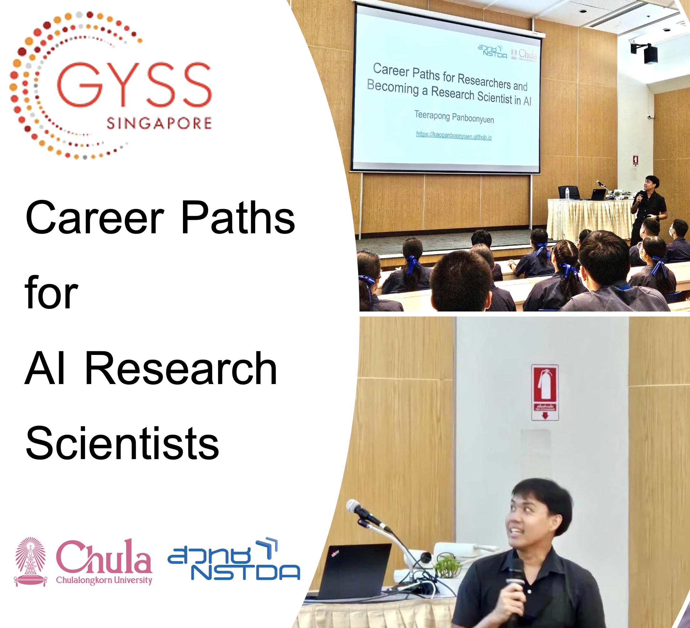
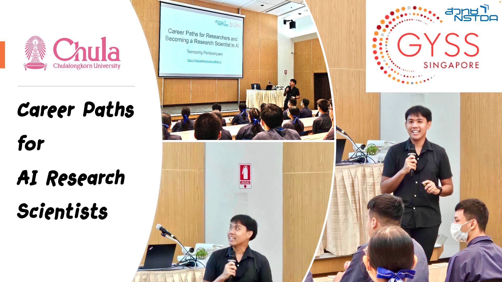
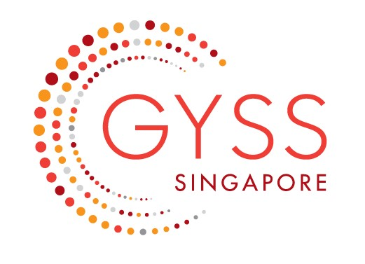

---

title: 'Career Paths for AI Research Scientists: My Journey and Insights'  
subtitle: ''  
summary: A thorough examination of my journey as an AI Research Scientist, including insights into balancing academia and industry, significant publications, and guidance for future researchers. 
authors:  
- admin  
tags:  
- ai-research
- ai-industry
- ai-applications  
- postdoctora-research
- deep-learning  
- computer-vision  
image:
  caption: 'Image credit: [**NSTDA**](https://www.nstda.or.th/en/)'
categories:  
- ai-research
- ai-industry
- research-scientists
- postdoctora-researcher
date: "2024-09-01T00:00:00Z"  
lastmod: "2024-09-01T00:00:00Z"  
featured: true  
draft: false
math: true

# Featured image
image:  
  caption: "Image source: https://www.nstda.or.th/en/"  
  placement: 2  
  focal_point: "Smart"  
  preview_only: false

# Projects (optional).
projects: []

---


{}
You can view the presentation slides for the talk 🌿 [here](https://kaopanboonyuen.github.io/files/slides/20240902_Career_Paths_for_Research_Scientists.pdf).
{}



## Introduction
Welcome to my blog! I'm thrilled to share insights from my journey in the world of Artificial Intelligence (AI) research. My name is Teerapong Panboonyuen (in Thai: ธีรพงศ์ ปานบุญยืน), but you can call me Kao (เก้า). I'm a Senior AI Research Scientist at MARS (Motor AI Recognition Solution) and a Postdoctoral Fellow at Chulalongkorn University. In this post, I'll discuss my career path, the balance between academic and industrial research, and some exciting trends in AI.

## My Journey into AI Research
My passion for AI began during my Master's degree in Computer Engineering at Chulalongkorn University. It was there that I first encountered the intriguing challenges and opportunities that AI research offered. However, my commitment to AI deepened during my Ph.D. studies at the same university. I graduated with a Master's degree at the age of 24 and earned my Ph.D. by 27. Since then, I have been immersed in AI research, focusing on fields like Remote Sensing and Computer Vision.

> Currently, I am a Postdoctoral Fellow in AI research, a role I have held from age 27 to the present, 31. My research spans the development of advanced algorithms in Pattern Recognition, Optimization Theory, and Statistical Learning. At MARS, I am involved in applying AI to real-world problems, particularly in the auto insurance industry.



## Balancing Academia and Industry
Why do I juggle both academic and industrial roles? The answer lies in the different kinds of excitement each provides. In academia, I'm drawn to the elegance and complexity of theoretical work—understanding AI at its core and pushing its boundaries. On the other hand, the industrial side offers the thrill of seeing AI solutions deployed in real-world applications, making a tangible impact.

{}
I firmly believe that combining both worlds enriches my research. It's incredibly fulfilling to publish groundbreaking work and even more exhilarating when that research translates into practical solutions that benefit society. This dual approach keeps me grounded in the realities of implementation while allowing me to explore theoretical possibilities.{}

## Key Qualities for Ideal AI Agents

The ideal characteristics (Fig. 1) envisioned for AI agents are numerous, each presenting its own significant research challenge before even considering the automatic acquisition of these traits:

- **Learning to learn**: The ability to enhance its learning process over time [2]–[8].
- **Lifelong learning**: Engaging in continual and incremental learning throughout its existence [9]–[13].
- **Gradual knowledge and skill accumulation**: Building up knowledge and abilities progressively, layer by layer.
- **Reuse of learned knowledge**: Applying previously acquired skills to discover and learn new ones, incorporating both forward and backward knowledge transfer [10].
- **Open-ended exploration**: The capability to explore without predefined boundaries [14], [15] and to set its own self-invented goals for learning [16]–[20].
- **Out-of-distribution generalization**: Extending its learning capabilities to new and previously unseen problems [21]–[24] and making logical extrapolations beyond its initial training data [25], [26].

<div style="text-align: center;">
  
  <p style="font-style: italic; margin-top: 0px;">Fig. 1. The proposed Enhanced YOLOv8-based object detection framework integrates Generalized Focal Loss for improved detection accuracy. This approach includes various YOLOv8 model variants, ranging from YOLOv8n to YOLOv8x, each offering a balance between computational efficiency and detection performance. The network architecture leverages convolutional layers with Batch Normalization and Leaky ReLU activations. The Generalized Focal Loss, designed to address class imbalance, enhances performance for small and difficult-to-detect objects by focusing on hard examples. The training utilizes the AdamW optimizer with specific hyperparameters to optimize convergence and model performance. <a href="https://example.com/your-research-link" target="_blank">[Your Research Link]</a></p>
</div>


There are various strategies to develop agents with these properties. At GoodAI, they have converged on foundational principles such as the modularity of agents, a shared policy across modules with varying internal states, and a blend of meta-learning in the outer loop followed by open-ended learning in the inner loop. These principles are central to their Badger architectures and will be discussed further in the section "Towards Implementation." It is essential to highlight that these desired properties should manifest during the agent's operational phase, specifically in the inner loop (the agent’s lifetime). They often utilize a meta-learning approach, which involves a bi-level optimization process where optimization occurs at two levels [4], [27], [28]. This meta-learning framework is considered the default setting throughout this discussion unless otherwise noted.

## The Cool Factor in Research
One of the key motivators for any researcher is the "cool factor"—that sense of excitement when working on something groundbreaking. For me, that thrill comes from applying AI to satellite imagery for Land Use and Land Cover (LULC) analysis in agriculture. The very idea of using AI to derive insights from images captured from space is inherently fascinating.

{}
Imagine using AI to assist in medical diagnostics. For instance, developing an AI model that can detect polyps or tumors during a colonoscopy more accurately than current state-of-the-art methods. Not only is this research cool, but it also has a profound impact—it can save lives. AI might not yet match human experts in every scenario, but as an early detection tool, its potential is undeniable.
{}

## Understanding the Three Types of Artificial Intelligence

For those pursuing a career as AI research scientists, it's essential to understand the different categories of AI based on their capabilities:

1. **Narrow AI (Weak AI or ANI):** Narrow AI is specialized in performing specific tasks. It is designed with a narrow focus and cannot operate outside its pre-defined capabilities. Research in this area involves developing and fine-tuning algorithms to perform specialized tasks efficiently, such as facial recognition, language translation, and recommendation systems. Career opportunities here include roles like AI specialist, data scientist, and machine learning engineer.

2. **General AI (Strong AI or AGI):** General AI aims to mirror human cognitive abilities, enabling it to understand, learn, and apply knowledge across a wide range of tasks. Working in this field requires a deep understanding of various AI and machine learning techniques, and researchers often focus on creating systems that can think and reason like humans. Careers in this area might involve research positions in advanced AI labs, academia, or tech companies that are pioneering AGI development.

3. **Artificial Superintelligence (ASI):** ASI represents the pinnacle of AI development, where machines would surpass human intelligence across all domains. Research here is still theoretical but involves exploring concepts that could eventually lead to machines with superior cognitive abilities. Professionals focusing on ASI are usually involved in speculative research, ethical considerations, and futuristic technology development. Career paths might include roles as AI ethicists, theoretical AI researchers, or innovators at cutting-edge research institutions.

Understanding these AI types (Fig. 2) can guide aspiring AI researchers in choosing the right focus area for their careers, whether it's enhancing specialized AI applications or contributing to the quest for creating truly intelligent machines. 

<div style="text-align: center;">
  
  <p style="font-style: italic; margin-top: 0px;">Fig. 2. Types of Artificial Intelligence (Image source: viso.ai, <a href="https://viso.ai/deep-learning/artificial-intelligence-types/" target="_blank">viso.ai/artificial-intelligence-types</a>)</p>
</div>

## Roadmap to Learn AI

Embark on a structured journey to master Artificial Intelligence with this comprehensive roadmap. Begin with foundational mathematics, including linear algebra, calculus, and statistics, essential for understanding AI concepts. Gain proficiency in tools like Python and PyTorch, and dive into machine learning by writing algorithms from scratch, competing in challenges, and deploying models. Expand your skills in deep learning through practical applications and competitive projects, and explore advanced topics like large language models. Stay updated with the latest trends and resources to ensure continuous learning and growth in the field of AI.

**Mathematics**
- **Linear Algebra**: Learn the fundamentals of linear algebra, crucial for understanding data manipulation and algorithmic operations. For a comprehensive introduction, refer to [3Blue1Brown’s Essence of Linear Algebra](https://www.3blue1brown.com/lessons/linear-algebra) and *Introduction to Linear Algebra for Applied Machine Learning with Python*. Dive deeper with [Imperial College London’s lectures on Linear Algebra](https://www.imperial.ac.uk/computing/prospective-students/courses/undergraduate/courses/linear-algebra-and-multivariate-calculus/).
- **Calculus**: Explore how calculus enables optimization in machine learning, crucial for learning algorithms and adjusting models. Key resources include [3Blue1Brown’s Essence of Calculus](https://www.3blue1brown.com/lessons/calculus) and [MIT OpenCourseWare’s Calculus Courses](https://ocw.mit.edu/courses/mathematics/18-01-single-variable-calculus-fall-2006/).
- **Probability and Statistics**: Understand the role of probability and statistics in making predictions and decisions under uncertainty. Useful resources are [StatQuest’s Statistics Fundamentals](https://www.youtube.com/channel/UCtK1v8qWJghuX-GEw5A9kQQ) and the book *Mathematics for Machine Learning*.

**Tools**
- **Python**: Begin with practical Python programming using [Practical Python Programming](https://www.udemy.com/course/python-for-data-science-and-machine-learning-bootcamp/) and advance to [Advanced Python Mastery](https://www.udemy.com/course/advanced-python-mastery/). For deeper insights, explore [David Beazley’s courses](https://www.dabeaz.com/).
- **PyTorch**: Learn PyTorch with [PyTorch Tutorials by Aladdin Persson](https://www.youtube.com/playlist?list=PLG2GkXjGgAr0UgfllZ3btzdkqT9lKjyRt) and use resources like the [official PyTorch tutorials](https://pytorch.org/tutorials/) and [Programming PyTorch for Deep Learning](https://www.oreilly.com/library/view/programming-pytorch/9781492045518/).

**Machine Learning**
- **Write from Scratch**: Practice building algorithms from scratch with repositories such as [ML-From-Scratch](https://github.com/eriklindernoren/ML-From-Scratch) and [homemade-machine-learning](https://github.com/trekhleb/homemade-machine-learning). For a more in-depth challenge, try [MiniTorch: A DIY Course on Machine Learning Engineering](https://www.youtube.com/playlist?list=PLZ9ACV_z1Zq_5jlBLuRTmExbQj-RD4O9D).
- **Compete**: Apply your skills in machine learning competitions on platforms like [Kaggle](https://www.kaggle.com/) and [bitgrit](https://bitgrit.net/). Study past winning solutions to enhance your learning.
- **Do Side Projects**: Start side projects using datasets from sources like [NASA Earth data](https://earthdata.nasa.gov/) and create user interfaces with [Streamlit](https://streamlit.io/). Refer to [Getting Machine Learning to Production](https://vickiboykis.com/2020/07/22/getting-machine-learning-to-production/) for practical insights.
- **Deploy Them**: Gain experience in deploying models and managing their lifecycle with resources like [Made With ML](https://madewithml.com/) and [Evidently AI](https://evidentlyai.com/). Learn about tracking experiments and monitoring model performance with [DataTalksClub’s MLOps Zoomcamp](https://datatalks.club/mlops-zoomcamp.html).
- **Supplementary**: Explore additional materials such as *Machine Learning with PyTorch and Scikit-Learn* and [Model Evaluation, Model Selection, and Algorithm Selection in Machine Learning](https://arxiv.org/abs/1811.12808).

**Deep Learning**
- **Fast.ai**: Engage with [Fast.ai’s courses](https://course.fast.ai/) for a top-down approach to deep learning. Explore further with [Full Stack Deep Learning](https://fullstackdeeplearning.com/) for a comprehensive view.
- **Do More Competitions**: Participate in advanced competitions like [PlantTraits2024](https://www.kaggle.com/c/plant-traits-2024) to apply deep learning techniques.
- **Implement Papers**: Study and implement research from resources like [labml.ai](https://labml.ai/) and [Papers with Code](https://paperswithcode.com/).
- **Computer Vision**: Delve into [CS231n: Deep Learning for Computer Vision](http://cs231n.stanford.edu/) for an in-depth understanding of computer vision applications.
- **NLP**: Learn from Stanford's [CS 224N: Natural Language Processing with Deep Learning](https://web.stanford.edu/class/cs224n/) and Hugging Face’s [NLP Course](https://huggingface.co/learn/nlp-course).

**Large Language Models**
- **Watch Neural Networks: Zero to Hero**: Get a comprehensive overview of large language models with [Andrej Karpathy’s Neural Networks: Zero to Hero](https://www.youtube.com/watch?v=O5xeyo8wFfQ).
- **Free LLM Boot Camp**: Explore free boot camps on LLMs, such as [Full Stack Deep Learning’s LLM Bootcamp](https://fullstackdeeplearning.com/llm-bootcamp/).
- **Build with LLMs**: Develop LLM applications using [Building LLM Applications for Production](https://huyenchip.com/2023/02/23/building-llm-applications-for-production.html) and [OpenAI Cookbook](https://github.com/openai/openai-cookbook).
- **Participate in Hackathons**: Join AI hackathons on [lablab.ai](https://lablab.ai/) and connect with other participants.
- **Read Papers**: Stay updated with LLM research from [Sebastian Raschka’s articles](https://sebastianraschka.com/) and [Papers with Code](https://paperswithcode.com/).
- **Write Transformers from Scratch**: Follow guides to build transformers from scratch, such as [The Transformer Family Version 2.0 | Lil’Log](https://lil-log.com/transformer-family-v2/).
- **Some Good Blogs**: Read insightful blogs like [Gradient Descent into Madness](https://lil-log.com/gradient-descent-into-madness/) and [The Illustrated Transformer](http://jalammar.github.io/illustrated-transformer/).
- **Watch Umar Jamil**: View detailed explanations and coding tutorials by [Umar Jamil](https://www.youtube.com/c/UmarJamil).
- **Learn How to Run Open-Source Models**: Get practical experience with open-source LLMs using [ollama](https://ollama.com/).
- **Prompt Engineering**: Study techniques for effective prompt engineering with resources like [Prompt Engineering | Lil’Log](https://lil-log.com/prompt-engineering/).
- **Fine-Tuning LLMs**: Explore guides on fine-tuning models with [Hugging Face’s fine-tuning guide](https://huggingface.co/docs/transformers/training) and [Fine-Tuning — The GenAI Guidebook](https://genai.ai/fine-tuning/).
- **RAG**: Learn about Retrieval-Augmented Generation with articles such as [Building RAG-based LLM Applications for Production](https://anyscale.com/blog/building-rag-based-llm-applications-for-production).

**How to Stay Updated**
- Regularly engage with leading blogs, research papers, and online courses to remain current with the latest advancements in AI and machine learning.

**Other Curriculums/Listicles You May Find Useful**
- Explore additional curriculums and listicles for a broader understanding of AI topics, available through various educational and professional resources.


## Highlighted Publications
Throughout my career, I've had the privilege to contribute to several exciting research projects. Below are some of my notable publications, each representing a unique challenge and innovative solution:

1. **[MARS Mask Attention Refinement with Sequential Quadtree Nodes for Car Damage Instance Segmentation](https://link.springer.com/chapter/10.1007/978-3-030-86725-1_21)**  
   *Published in: ICIAP 2023 Workshops, Lecture Notes in Computer Science, Springer, Cham*  
   This paper introduces a novel approach for car damage detection using Mask Attention Refinement with sequential quadtree nodes, specifically designed to enhance accuracy in the segmentation of damaged areas on vehicles.

2. **[MeViT: A Medium-Resolution Vision Transformer for Semantic Segmentation on Landsat Satellite Imagery for Agriculture in Thailand](https://www.mdpi.com/2072-4292/15/21/5124)**  
   *Published in: Remote Sensing, 2023*  
   MeViT is a Vision Transformer-based model that processes medium-resolution satellite images to classify different types of land cover in agricultural areas. This research has significant implications for monitoring and managing agricultural resources.

3. **[Object Detection of Road Assets Using Transformer-Based YOLOX with Feature Pyramid Decoder on Thai Highway Panorama](https://www.mdpi.com/2078-2489/13/1/5)**  
   *Published in: Information, 2022*  
   This paper explores an innovative method for detecting road assets, such as traffic signs and barriers, using a Transformer-based YOLOX model. The approach significantly improves the accuracy and reliability of object detection in complex environments.

4. **[Transformer-Based Decoder Designs for Semantic Segmentation on Remotely Sensed Images](https://www.mdpi.com/2072-4292/13/24/5100)**  
   *Published in: Remote Sensing, 2021*  
   Here, we investigate the use of Transformer-based architectures for segmenting high-resolution remote sensing images. This work pushes the boundaries of traditional convolutional neural networks by leveraging the power of self-attention mechanisms.

5. **[Semantic Labeling in Remote Sensing Corpora Using Feature Fusion-Based Enhanced Global Convolutional Network](https://www.mdpi.com/2072-4292/12/8/1233)**  
   *Published in: Remote Sensing, 2020*  
   This publication introduces a feature fusion approach for semantic labeling tasks, combining multiple feature maps to improve the accuracy of land cover classification in remote sensing imagery.

## Key Trends in AI Research
The field of AI is constantly evolving, with several exciting trends emerging. Here's a look at some of the most promising areas:

- **Generative AI**: With models like GANs and diffusion models, generative AI is revolutionizing how we create content, from art and music to realistic simulations.
  
- **Self-Supervised Learning**: This approach is gaining traction as it reduces the need for labeled data, making it easier to train AI models on vast datasets.

- **AI for Social Good**: Applications of AI in healthcare, environmental monitoring, and disaster response highlight the technology's potential to solve some of humanity's biggest challenges.

- **Explainable AI (XAI)**: As AI systems become more complex, the need for transparency and interpretability is critical. XAI focuses on making AI decisions understandable to humans.

- **AI Security and Ethics**: With the growing deployment of AI, addressing ethical considerations and ensuring AI security are more important than ever.

## Inspiration for Aspiring Researchers
For those considering a career in AI research, my advice is simple: find a topic that excites you. Choose projects that you find inherently cool. This passion will sustain you through the challenges of research. Start by exploring current literature to understand what has already been done and identify gaps. Decide whether to build on existing models or innovate from scratch. Focus on how you can improve accuracy, speed, or applicability of AI solutions.

> Remember, research is a journey, not a destination. Be curious, be patient, and never stop learning. The most rewarding part of research is not just the recognition that comes from publishing a paper but seeing your work make a real-world impact. Whether it's through advancing technology or improving lives, your contribution as a researcher can make a difference. 

## Before I Go: Here’s Some Exciting News!

I’m thrilled to announce that I’ve been awarded a prestigious scholarship by Her Royal Highness Princess Maha Chakri Sirindhorn to attend the Global Young Scientists Summit (GYSS) in Singapore from January 6-10, 2025. This recognition is a major boost for my passion and drive to push the envelope in innovation!


The **Global Young Scientists Summit (GYSS)** is a dynamic annual event that brings together exceptional young researchers and leading scientific minds from around the world. Held in Singapore, this summit is a unique platform for discussing groundbreaking research and exploring how it can address major global challenges. 

With a strong emphasis on innovation and collaboration, GYSS is where future scientific leaders converge to share ideas and shape the future of research. To dive deeper into this inspiring event, visit [GYSS](https://www.gyss-one-north.sg) and join the conversation using #GYSS!



> Just a heads up—once I wrap up at GYSS, I'll be crafting a new blog to share all the awesome experiences with you. Stay tuned!

## Conclusion
Being part of the AI revolution is a unique privilege. It's a field where theoretical elegance meets real-world impact, offering endless opportunities for those willing to explore. Whether you are inclined toward academia or industry, or like me, both, there is a place for you in AI research. Let's continue to push the boundaries and contribute to a future where AI plays a positive and transformative role in our lives.

> Thank you for reading! I look forward to hearing your thoughts and engaging in discussions about AI research and career paths.

## Citation

> Panboonyuen, Teerapong. (Sep 2024). *Career Paths for AI Research Scientists: My Journey and Insights*. Blog post on Kao Panboonyuen. [https://kaopanboonyuen.github.io/blog/2024-09-01-career-paths-for-ai-research-scientist/](https://kaopanboonyuen.github.io/blog/2024-09-01-career-paths-for-ai-research-scientist/)

Or

```bash
@article{panboonyuen2024careerpaths,
  title   = "Career Paths for AI Research Scientists: My Journey and Insights.",
  author  = "Panboonyuen, Teerapong",
  journal = "kaopanboonyuen.github.io/",
  year    = "2024",
  month   = "Sep",
  url     = "https://kaopanboonyuen.github.io/blog/2024-09-01-career-paths-for-ai-research-scientist/"
}
```

{}
Did you find this page helpful? Consider sharing it 🙌
{}

## References

1. https://www.upwork.com/resources/how-to-become-an-ai-research-scientist/
2. https://varthana.com/student/skills-required-to-get-a-job-in-the-artificial-intelligence-industry/
3. https://www.goodai.com/goodai-research-roadmap-2021-2022/
4. https://medium.com/bitgrit-data-science-publication/a-roadmap-to-learn-ai-in-2024-cc30c6aa6e16/
5. https://viso.ai/deep-learning/artificial-intelligence-types/