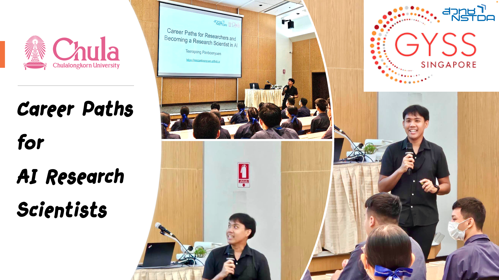

### Exploring Career Paths in AI Research

I recently had the privilege of engaging with high school students on the topic of “Career Paths for AI Research Scientists.” As Teerapong Panboonyuen, also known as Kao Panboonyuen, I’m a Senior AI Research Scientist at MARS and a Postdoctoral Fellow at Chulalongkorn University. This talk was an excellent opportunity to share my journey and insights into the world of artificial intelligence (AI), and to guide aspiring young minds through the myriad opportunities within this transformative field.

### The World of AI: A Technical Overview

During the talk, I introduced the students to the complex and exciting realm of AI. My background includes a Ph.D. in Computer Engineering with a focus on Artificial Intelligence, Machine Learning, and Deep Learning from Chulalongkorn University. In my current role, I’m deeply involved in advanced research and development across various AI domains.

#### **Understanding AI Models**

One of the core topics discussed was the creation and application of AI models. My research includes tasks such as:

- **Image Classification:** Developing algorithms that can accurately categorize images into predefined classes. For example, my work on the “MeViT: A Medium-Resolution Vision Transformer for Semantic Segmentation” highlights the use of Vision Transformers (ViTs) for high-accuracy semantic segmentation in satellite imagery.

- **Object Detection:** Designing models to identify and locate objects within an image. The “Object Detection of Road Assets Using Transformer-Based YOLOX with Feature Pyramid Decoder” is a key example where we leverage advanced object detection techniques for analyzing road assets in Thai highway panoramas.

- **Instance Segmentation:** Extending object detection to not just identify but also segment individual instances of objects. My research, such as “MARS Mask Attention Refinement with Sequential Quadtree Nodes for Car Damage Instance Segmentation,” showcases the use of sophisticated attention mechanisms for precise damage detection.

- **Domain Adaptation:** Improving model performance across different but related domains. Techniques I use involve adapting models trained on one dataset to perform well on another, a crucial aspect of making AI systems more versatile and robust.

- **Explainable AI (XAI) and Interpretable AI:** Developing methods to make AI decisions more transparent and understandable. My work involves creating models that not only perform well but also provide insights into their decision-making processes.

### Career Paths in AI Research

Exploring the diverse career opportunities in AI, I shared insights into several key roles:

- **Academic Researcher:** This role involves advancing theoretical understanding and pushing the boundaries of AI knowledge. My academic contributions, such as those found in “Semantic Labeling in Remote Sensing Corpora Using Feature Fusion-Based Enhanced Global Convolutional Network,” reflect the innovative approaches necessary for academic research.

- **Industry Research Scientist:** Applying research to solve real-world problems is the focus here. At MARS, I’m involved in developing practical AI solutions for the auto insurance industry, translating cutting-edge research into deployable technologies.

- **Data Scientist:** This role revolves around analyzing complex datasets and applying AI techniques to extract valuable insights. My expertise in platforms like GCP and AWS, coupled with proficiency in tools such as Python, PyTorch, and Hugging Face, is crucial for executing data-driven strategies.

- **Machine Learning Engineer:** Implementing and optimizing AI models for production use is key in this role. My skills in managing cloud resources with Docker-Compose and Kubernetes, and using Gradio for model deployment, exemplify the technical proficiency required for this position.

### My Journey as a Postdoctoral Researcher

Reflecting on my experiences as a postdoctoral researcher, I emphasized the continuous learning and adaptation necessary for success in AI. My journey includes:

- Conducting research that spans a wide range of AI applications, from road segmentation using deep convolutional neural networks to semantic segmentation with enhanced global convolutional networks.
- Publishing key papers such as “Semantic Segmentation on Remotely Sensed Images Using an Enhanced Global Convolutional Network” and “An Enhanced Deep Convolutional Encoder-Decoder Network for Road Segmentation on Aerial Imagery,” which highlight advancements in AI techniques and methodologies.

### Inspiring the Next Generation

Engaging with students and discussing their potential career paths in AI was incredibly rewarding. My aim was to inspire and provide practical guidance on how to enter and excel in the field of AI. As AI continues to evolve, the opportunities for new research and innovations are vast. I hope my insights into the various career paths and my own journey will motivate young minds to explore and pursue their passions in this exciting field.

> Super excited to share that I’ve snagged a scholarship from Her Royal Highness Princess Maha Chakri Sirindhorn to hit up the Global Young Scientists Summit (GYSS) in Singapore from January 6-10, 2025. It’s a huge boost for my commitment to pushing the boundaries of innovation!

**P.S.** For a deep dive into career paths for AI research scientists, including my personal journey and insights, check out the full blog and slides here: [Career Paths for AI Research Scientists](https://kaopanboonyuen.github.io/blog/2024-09-01-career-paths-for-ai-research-scientist/)

### Conclusion

Speaking about AI research careers offered a reflective look at my professional journey while providing valuable insights into the field. AI is a rapidly advancing domain with limitless potential. For those passionate about technology and eager to make a difference, diving into AI research presents an exciting and impactful career path. Stay curious, embrace continuous learning, and explore the many possibilities that AI has to offer.