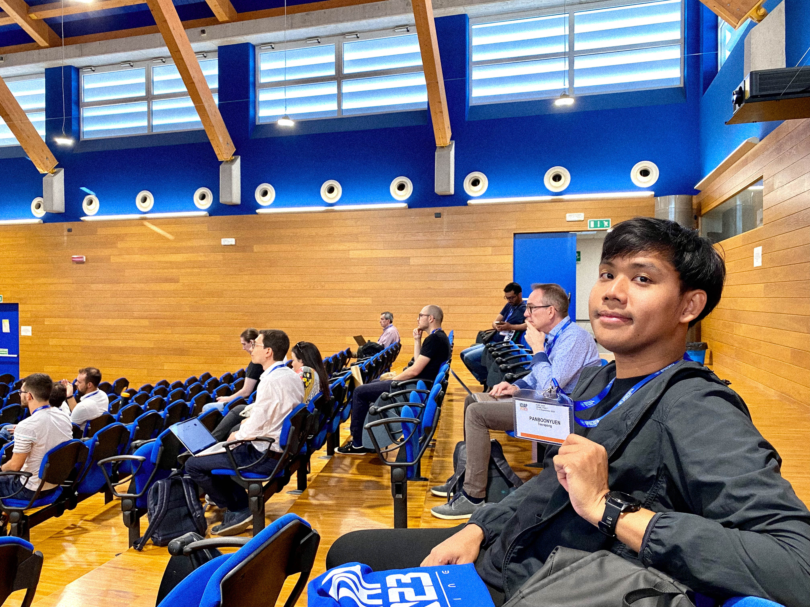
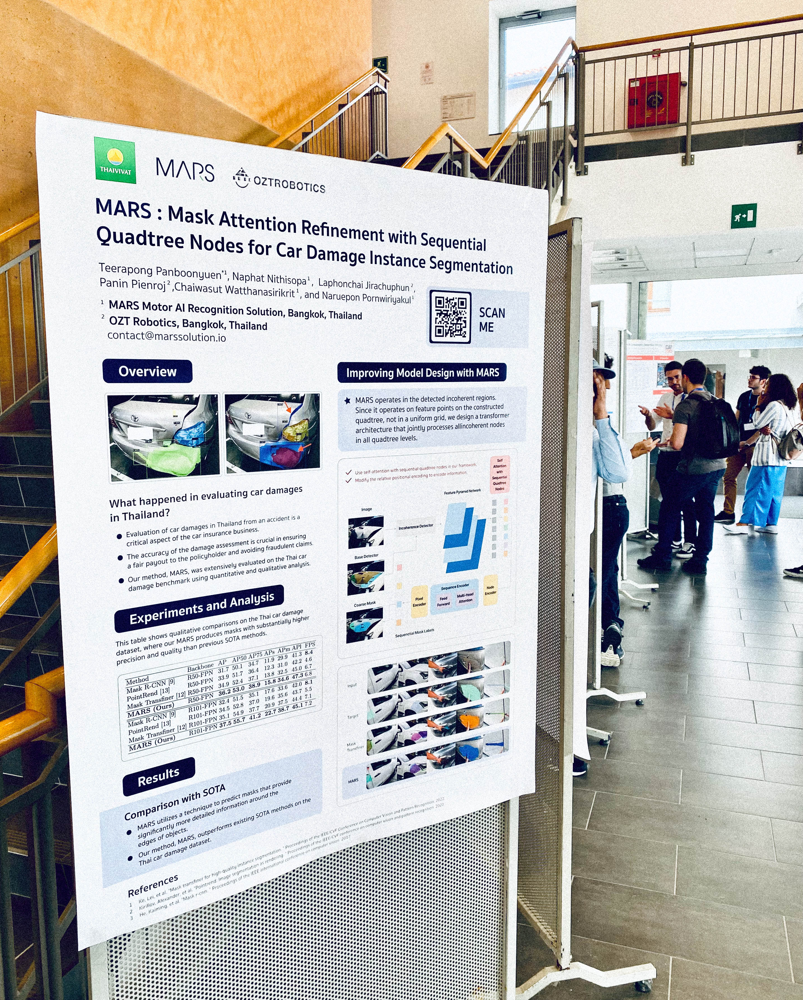
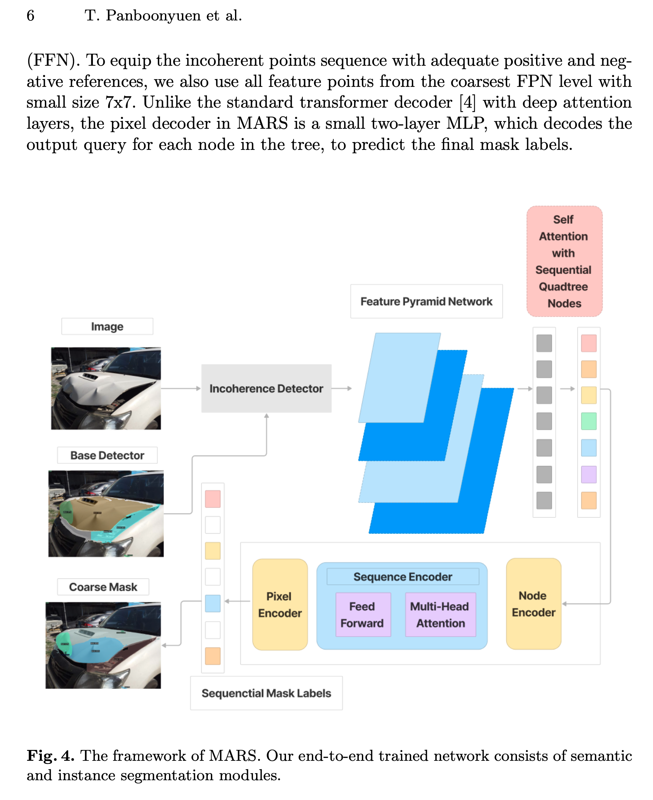
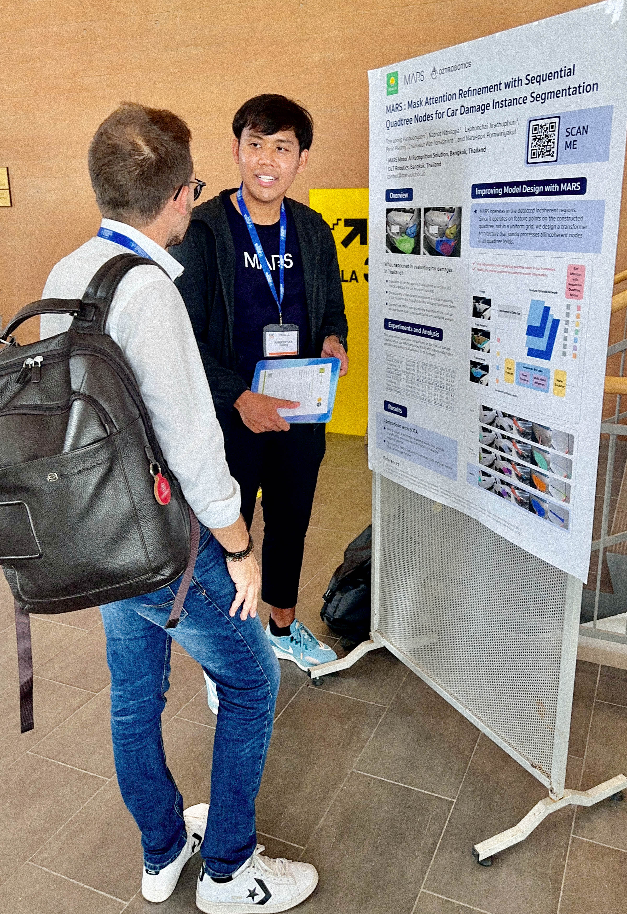
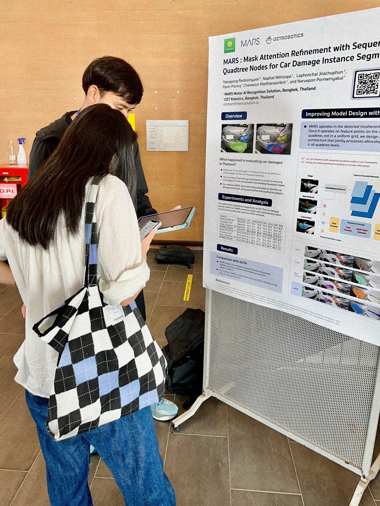
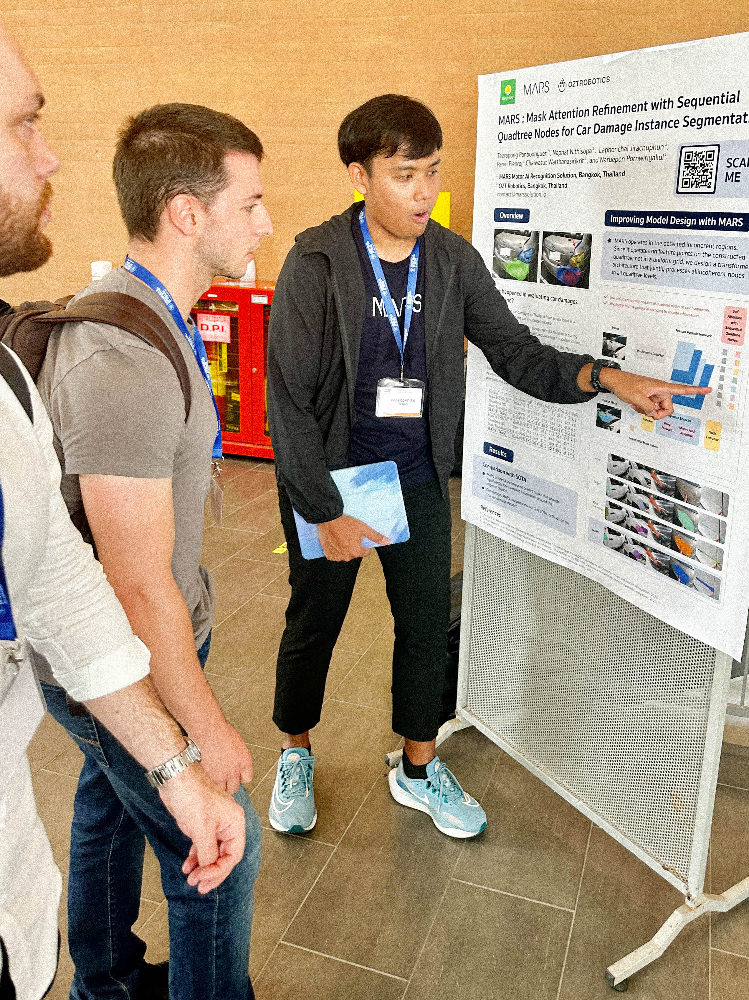
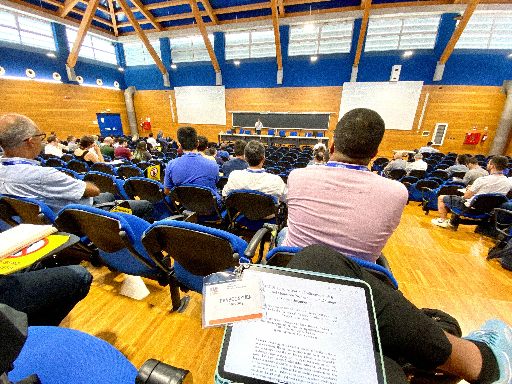
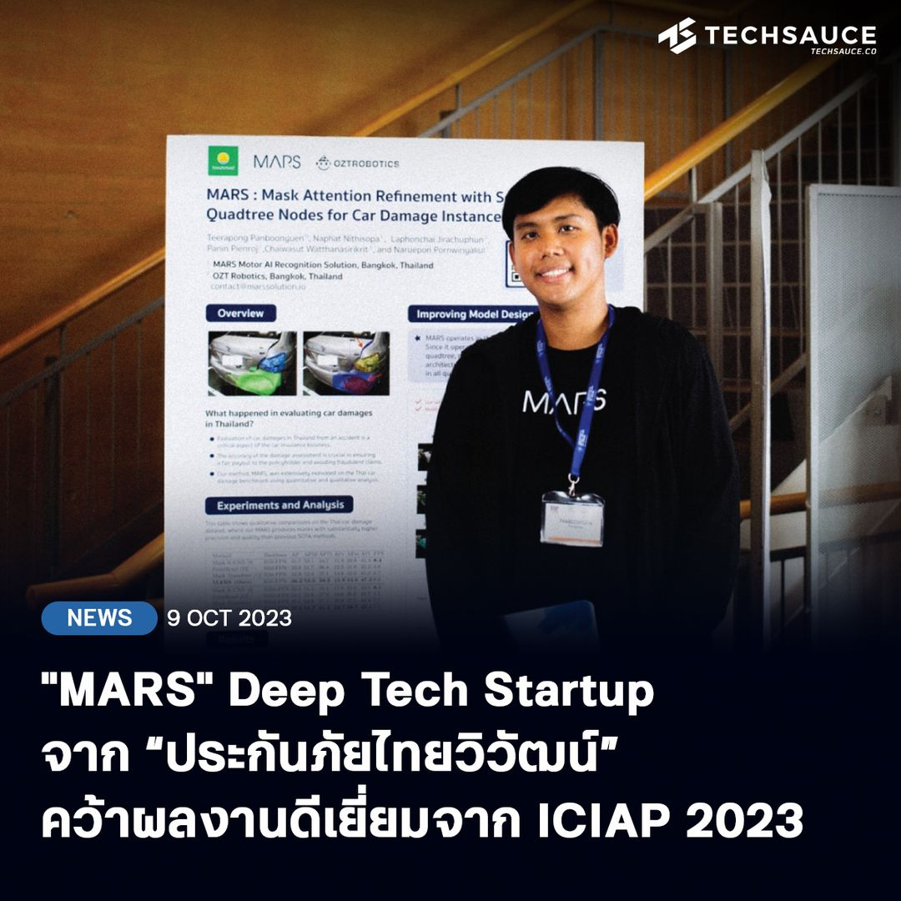

I am excited to share that my research, **"MARS: Mask Attention Refinement with Sequential Quadtree Nodes,"** was accepted for presentation at the **ICIAP 2023 Workshop** in Italy. This prestigious conference, held biennially by the CVPL under the International Association for Pattern Recognition (IAPR), brought together leading experts from around the world to discuss the latest advancements in car insurance and computer vision technologies.

My research addressed the critical challenge of evaluating car damages with greater accuracy. Current deep learning networks struggle with this task, producing coarse segmented masks that are not suitable for real-world applications. To tackle this issue, I developed MARS, which employs self-attention mechanisms and quadtree transformers to refine instance segmentation accuracy. MARS represents a significant advancement in the field by drawing global dependencies between sequential quadtree nodes and recalibrating channel weights to predict highly accurate instance masks.

The extensive experiments conducted as part of my research demonstrated that MARS outperforms several state-of-the-art instance segmentation methods, including Mask R-CNN, PointRend, and Mask Transfiner. Specifically, MARS achieved a substantial improvement in maskAP scores, with a +1.3 increase using the R50-FPN backbone and a +2.3 increase with the R101-FPN backbone on the Thai car-damage dataset. These results highlight the potential of MARS to significantly enhance the accuracy of car damage evaluations, offering promising applications for the car insurance industry.

<!--  -->

  
  
Fig. 1. I have published an article with Techsauce. (Image source: techsauce.co, <a href="https://techsauce.co/news/mars-deep-tech-startup-thaivivat-ai" target="_blank">mars-deep-tech-startup-thaivivat-ai</a>)

> Thank you to Techsauce, the Thai tech news agency, for showcasing my research on the application of AI in the auto insurance and garage industry. You can read the full article here: [Techsauce](https://techsauce.co/news/mars-deep-tech-startup-thaivivat-ai).

Presenting my findings at ICIAP 2023 was a fantastic opportunity to engage with fellow researchers and industry professionals, exploring the opportunities, challenges, and future directions in this rapidly evolving field.