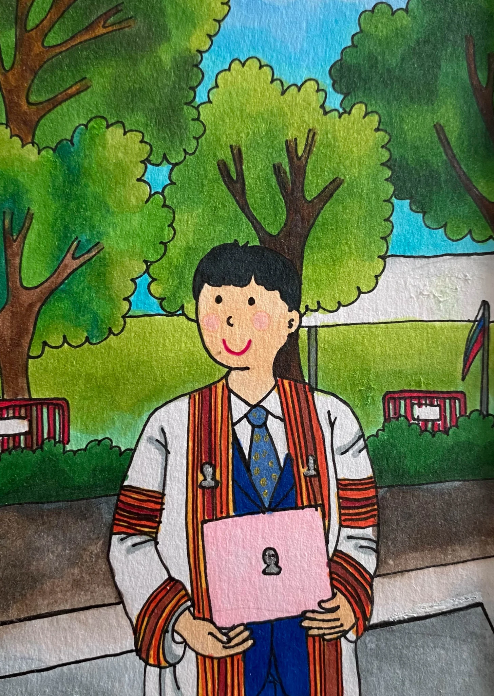
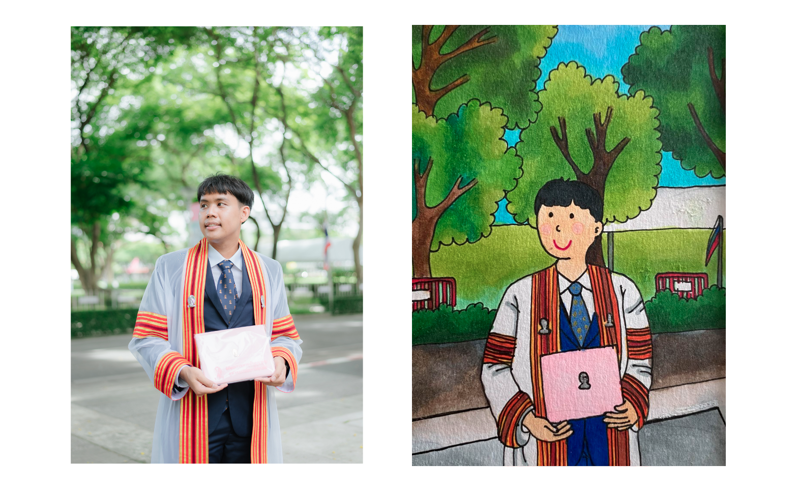
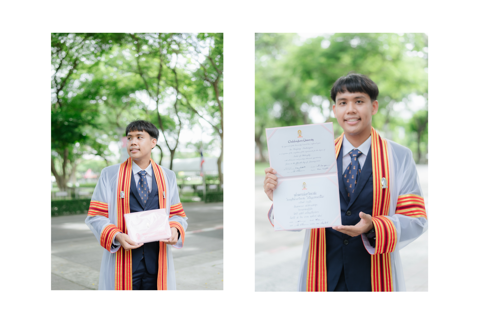

### PhD Journey: A Milestone Achieved

On May 19, 2022, I proudly completed my PhD at Chulalongkorn University, closing a remarkable chapter in my academic journey. This milestone was not just a moment of personal triumph, but also a time of reflection and deep gratitude. Graduating with a doctoral degree was a dream realized, filled with emotions that I will carry with me forever.

Throughout this journey, I was fortunate to have the unwavering support of incredible mentors, advisors, colleagues, and friends. Their guidance and encouragement were instrumental in my success, and having them by my side on this special day was a poignant reminder of the profound impact they've had on both my academic and personal development.

<!--  -->

Completing a PhD is more than just an academic achievement; it's a journey of personal growth. It demands perseverance, resilience, and the ability to navigate and overcome numerous challenges. My passion for machine learning and my commitment to research were the driving forces that kept me moving forward, enabling me to make meaningful contributions to the field.

### PhD Thesis Highlights

One of the core challenges in remote sensing is the semantic segmentation of aerial and satellite images, which is crucial for agriculture planning, map updates, route optimization, and navigation. The prevailing model at the time was the Deep Convolutional Encoder-Decoder (DCED), which faced limitations in accuracy due to its inability to recover low-level features, such as rivers and low vegetation, and the scarcity of training data.

My thesis tackled these issues by introducing a novel semantic segmentation architecture tailored for remote sensing. Key innovations included:

- **Global Convolutional Network (GCN)**: A modern CNN architecture designed to enhance feature extraction.
- **Channel Attention**: An approach to select the most discriminative filters for improved feature representation.
- **Domain-Specific Transfer Learning**: A technique to address the issue of limited training data.
- **Feature Fusion (FF)**: An addition to capture and integrate low-level features effectively.
- **Depthwise Atrous Convolution (DA)**: A method to refine extracted features for greater accuracy.

These advancements were validated through experiments on three datasets: two private corpora from Landsat-8 satellite and one public benchmark from the ISPRS Vaihingen challenge. The results demonstrated that our proposed architecture significantly outperformed the baseline model across all remote sensing imagery.

> Explore more about my PhD story [here](https://kaopanboonyuen.wordpress.com/2022/05/23/the-phd-journey/).

**Kao Panboonyuen**