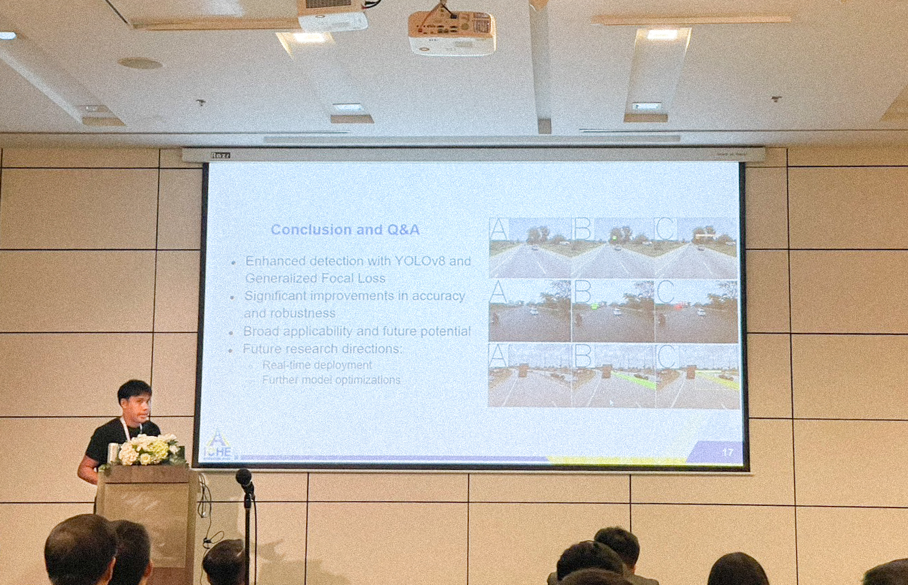

### Exciting News: Oral Presentation at iCHE 2024!

I am thrilled to share that our paper titled **"Enhanced YOLOv8-Based Object Detection of Road Assets Utilizing Generalized Focal Loss: A Case Study on Thai Highway Imagery"** has been accepted for an oral presentation at the **5th International Conference on Highway Engineering (iCHE 2024)**! After a long absence from international conferences since my Ph.D. studies, I'm incredibly excited to rejoin the academic community in person and present our latest research.

> Dive into the complete details of our research on road asset detection in Thai highways with advanced vision models. Check out the full blog post here: [Refined Generalized Focal Loss for Road Asset Detection](https://kaopanboonyuen.github.io/blog/2024-09-06-refined-generalized-focal-loss-for-road-asset-detection-on-thai-highways-using-vision-models/)

Stay tuned for updates, and a big thank you to my incredible research team:  
**N. Rattanachona**, **P. Thungthin**, **N. Subsompon**, **S. Thongbai**, **W. Wongweeranimit**, and **R. Phukham**. I’m grateful for your hard work and dedication to this project!

Here I am, presenting our work on the Enhanced YOLOv8 model and its application in detecting road assets!

#### Paper Highlights:
Our research tackles a critical challenge in road safety and infrastructure management: detecting essential road assets such as pedestrian bridges, pavilions, signs, and concrete guardrails. We introduce an enhanced YOLOv8 model integrated with **Generalized Focal Loss**, which significantly improves detection accuracy, especially in complex environments with varied lighting and backgrounds.

The results speak for themselves:
- **mAP50**: 80.340
- **mAP50-95**: 60.840
- **Precision**: 79.100
- **Recall**: 76.680
- **F1-Score**: 77.870

These metrics highlight the robustness and precision of our method, underscoring its potential to enhance road safety initiatives.

#### What’s Next?
In addition to being featured in the conference proceedings, our paper will go through a **fast-track formal review process** for potential publication in the **Transportmetrica A journal** (published by Taylor and Francis). We’re hopeful that this work will make a meaningful contribution to the field of highway engineering and road asset management.

I look forward to sharing more about our research and connecting with fellow researchers at iCHE 2024!
